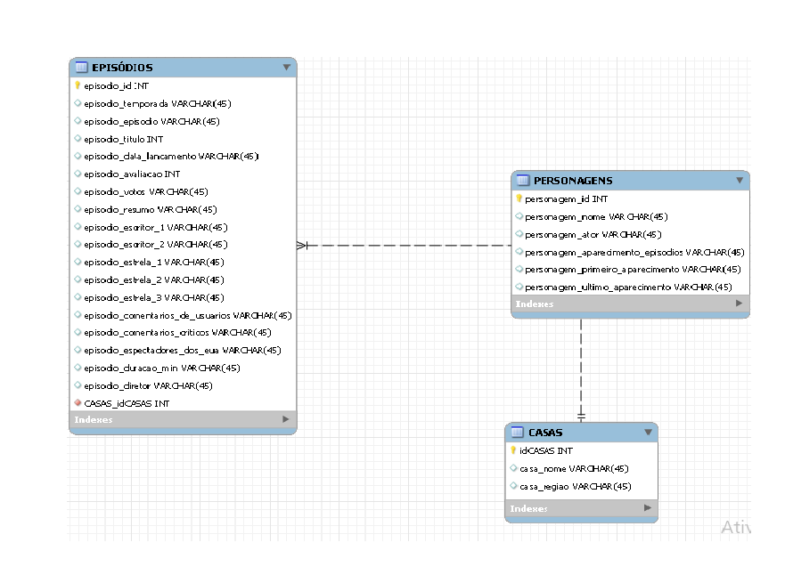
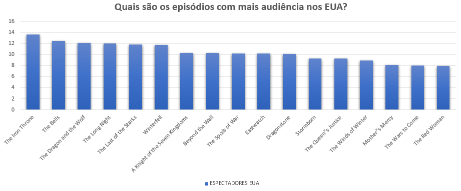
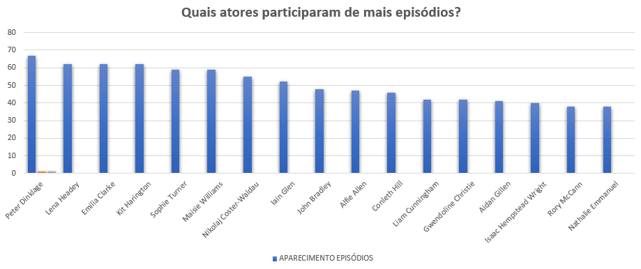

# Projeto Visualizando a situação

O objetivo deste projeto foi criar um dashboard para explorar e apresentar um conjunto de dados sobre a série "Game of Thrones". O projeto teve como objetivo resolver o problema de acúmulo de dados sem uma visão padronizada.
O processo envolveu a modelagem das tabelas do banco de dados, a criação de visualizações dos dados e a montagem de uma apresentação com as perguntas e análise exploratória dos dados selecionados.

Brainstorm de perguntas: Nós elaboramos perguntas que poderiam ser respondidas pelos dados fornecidos.

Estruturação do esquema do banco de dados: Com base nos dados fornecidos, modelamos as tabelas do banco de dados de forma a atender às perguntas elaboradas.

Criação de visualizações: Utilizamos planilhas Excel para criar visualizações dos dados com base nas perguntas elaboradas.

Montagem da apresentação: Com base nas perguntas e na análise exploratória dos dados, montamos uma apresentação para compartilhar nossos resultados.

# <h3 align="center">Game of Thrones </h3>

Game of Thrones é uma série de televisão americana baseada na série de livros "As Crônicas de Gelo e Fogo" escrita por George R.R. Martin. A série é ambientada em Westeros e Essos, dois continentes fictícios, e segue uma série de alianças e conflitos entre as famílias nobres dinásticas na luta pelo Trono de Ferro, símbolo do poder sobre todos os sete reinos. A série é conhecida por seu elenco vasto de personagens complexos, sua trama envolvente e intensa ação, e seus twists surpreendentes.
<br>


# <h3 align="center">Diagrama</h3>



<hr>

```sh 
Quais os episódios mais bem avaliados?
```


Consulta e retorno


```sh 
Quais os episódios mais longos?
```


Consulta e retorno


```sh
Quais os episódios com mais audiência nos EUA?
```




Consulta e retorno


```sh
Quais atores participaram de mais episódios?
```




Consulta e retorno


```sh
Quais são os episódios mais populares? (baseado no número de comentários da crítica + comentários de usuários)
```

.png)


Consulta e retorno


<h2 align="center">Ferramentas Utilizadas</h2>

<div style="display: inline_block" align = "center">


</div>
